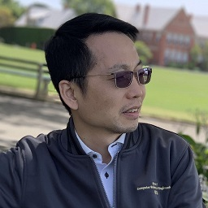

## Biography
Jianfei is a Professor at Faculty of IT, Monash University, where he currently serves as the Head for the Data Science & AI Department. Before that, he was a full professor, a cluster deputy director of Data Science & AI Research center (DSAIR), Head of Visual and Interactive Computing Division and Head of Computer Communications Division in Nanyang Technological University (NTU). His major research interests include visual computing, computer vision, and multimedia. He has published more than 200 technical papers in international conferences and journals. He is a co-recipient of paper awards in ACCV, ICCM, IEEE ICIP and MMSP. He is currently at the editorial board of IJCV and has served as an Associate Editor for IEEE T-IP, T-MM, T-CSVT and Visual Computer as well as serving as Area Chair for CVPR, ICCV, ECCV, IJCAI, ACM Multimedia, ICME, ICIP and ISCAS. He was the Chair of IEEE CAS VSPC-TC during 2016-2018. He had also served as the leading TPC Chair for IEEE ICME 2012 and the best paper award committee chair & co-chair for IEEE T-MM 2020 & 2019. He is a Fellow of IEEE.

## General information
- Research interests: visual computing, computer vision, deep learning, vision&language, 3D vision, multimedia, visual signal processing and networking
- Address: Prof. Jianfei Cai, Dept. of DSAI, Faculty of IT, Monash University, Clayton VIC 3800
- Email: jianfei.cai AT monash.edu
- Links: [[Monash website]](https://research.monash.edu/en/persons/jianfei-cai), [[Google Scholar]](https://scholar.google.com/citations?hl=en&user=N6czCoUAAAAJ)
- index: [[Recent work]](#recent-work), [[Major work on visual computing & vision]](#major-work-on-visual-computing-and-computer-vision), [[Major work on VSPC]](#major-work-on-visual-signal-processing-and-networking), [[Other demos]](#other-demos)

## Updates

## Recent work
- C. Zheng, T.-J. Cham, J. Cai and D. Phung, “Bridging global context interactions for high-fidelity image completion”, CVPR 2022.[[paper&code]](https://github.com/lyndonzheng/TFill)
- H. Xu, J. Zhang, J. Cai, H. Rezatofighi and D. Tao, “GMFlow: learning optical flow via global matching”, CVPR 2022. [[paper&code]](https://github.com/haofeixu/gmflow)
- H. Shi, M. Hayat, Y. Wu and J. Cai, “ProposalCLIP: unsupervised open-category object proposal generation via exploiting CLIP cues”, CVPR 2022. [[paper]](https://arxiv.org/abs/2201.06696)
- Z. Pan, B. Zhuang, H. He, J. Liu and J. Cai, “Less is more: pay less attention in vision transformers”, AAAI 2022. [[paper]](https://arxiv.org/abs/2105.14217)[[code]](https://github.com/zhuang-group/LIT)
- X. Yang, H. Zhang and J. Cai, “Deconfounded image captioning: a causal retrospect”, accepted by TPAMI, 10.1109/TPAMI.2021.3121705. [[paper]](https://arxiv.org/abs/2003.03923)

[Back to top](#biography)

## Major work on visual computing and computer vision
- H. Xu, J. Yang, J. Cai, J. Zhang and X. Tong, “High-resolution optical flow from 1d attention and correlation”, ICCV 2021 (Oral). [[paper]](https://arxiv.org/pdf/2104.13918.pdf)
- Z. Pan, B. Zhuang, J. Liu, H. He and J. Cai, “Scalable visual transformers with hierarchical pooling”, ICCV 2021. [[paper]](https://arxiv.org/abs/2103.10619)[[code]](https://github.com/zhuang-group/HVT)
- Z. Wu, X. Shi, G. Lin and J. Cai, “Learning meta-class memory for few-shot semantic segmentation”, ICCV 2021. [[paper]](https://arxiv.org/abs/2108.02958)[[code]](https://github.com/MonashAI/HVT)
- X. Yang, C. Gao, H. Zhang and J. Cai, “Auto-parsing network for image captioning and visual question answering”, ICCV 2021.
- C. Lin, Z. Yuan, S. Zhao, P. Sun. C. Wang and J. Cai, “Domain-invariant disentangled network for generalizable object detection”, ICCV 2021.
- D. Ren, J. Zheng, J. Cai, et al., “CSG-Stump: A learning friendly csg-like representation for interpretable shape parsing”, ICCV 2021. [[paper&code]](https://kimren227.github.io/projects/CSGStump/)
- Y. Cai, Y. Wang, Y. Zhu, T.-J. Cham, J. Cai, et al., “A unified 3D human motion synthesis model via conditional variational auto-encoder”, ICCV 2021. [[paper]](https://openaccess.thecvf.com/content/ICCV2021/papers/Cai_A_Unified_3D_Human_Motion_Synthesis_Model_via_Conditional_Variational_ICCV_2021_paper.pdf)[[code]](https://github.com/vanoracai/A-unified-3d-human-motion-synthesis-model-via-conditional-variational-auto-encoder)
- Y. Wu, M. Xu, Z. Ge, J. Cai, L. Zhang, “Semi-supervised Left Atrium Segmentation with Mutual Consistency Training”, MICCAI 2021. [[paper]](https://arxiv.org/abs/2103.02911)
- C. Zheng, T.-J. Cham and J. Cai “The Spatially-Correlative Loss for Various Image Translation Tasks”, CVPR 2021. [[paper]](https://arxiv.org/abs/2104.00854)[[code]](https://github.com/lyndonzheng/F-LSeSim)[[project]](https://www.chuanxiaz.com/publication/flsesim/)
- X. Yang, H. Zhang, G.-J. Qi and J. Cai, “Causal Attention for Vision-Language Tasks”, CVPR 2021.
- J. Wang, T. Lukasiewicz, X. Hu, J. Cai and Z. Xu, “RSG: A simple yet effective module for learning imbalanced datasets”, CVPR 2021. [[code]](https://github.com/Jianf-Wang/RSG)
- Q. Tao, C.-C. Loy, J. Cai, Z. Ge and S. See, "Retrospective class incremental learning", IEEE ICME 2021. [[paper]](ICME2021_camera_ready_final.pdf)
- C. Zheng, D. Dao, G. Song, T.-J. Cham and J. Cai, “Visiting the invisible: layer-by-layer completed scene decomposition”, accepted by IJCV. [[paper]](https://arxiv.org/abs/2104.05367)[[project]](https://github.com/lyndonzheng/VINV)
- C. Zheng, T.-J. Cham and J. Cai, “Pluralistic Free-Form Image Completion”, accepted by IJCV.
- G. Song, T.-J. Cham, J. Cai and J. Zheng, “Half-body portrait relighting with overcomplete lighting representation”, CGF, https://doi.org/10.1111/cgf.14384. [[paper]](https://guoxiansong.github.io/homepage/paper/relight_resize.pdf)[[video]](https://www.youtube.com/watch?v=QUeLs0o2CEw)[[code]](https://github.com/GuoxianSong/Portrait-Relighting)[[dataset]](https://drive.google.com/drive/folders/1Myh0Dck6FQV-yaeDUnz9swkWCcMb_Bwn)
- Z. Shao , J. Cai, T.-J. Cham, X. Lu, and L. Ma, “Unconstrained facial action unit detection via latent feature domain”, IEEE Trans on Affective Computing, 2021, 10.1109/TAFFC.2021.3091331. [[paper]](https://arxiv.org/abs/1903.10143)
- X. Yang, H. Zhang and J. Cai, “Auto-encoding and distilling scene graphs for image captioning”, accepted by TPAMI, 10.1109/TPAMI.2020.3042192.
- J. Gu, J. Kuen, S. Joty, J. Cai, V. Morariu, H. Zhao and T. Sun, “Self-supervised relationship probing”, NeurIPS 2020. 
- Z. Shao , Z. Liu , J. Cai , and L. Ma, “JAA-Net: Joint Facial Action Unit Detection and Face Alignment via Adaptive Attention”, IJCV, vol. 129, no. 2, pp.321-340, 2021.  [[paper]](https://arxiv.org/abs/2003.08834) [[code]](https://github.com/ZhiwenShao/PyTorch-JAANet)
- X. Yang. C. Gao, H. Zhang and J. Cai, “Hierarchical scene graph encoder-decoder for image paragraph captioning”, ACM Multimedia 2020.
- K. Chen, J. Zhang, J. Cai and J. Zheng, “Modeling caricature expressions by 3D blendshape and dynamic texture”, ACM Multimedia 2020. [[paper]](https://arxiv.org/abs/2008.05714)
- X. Shi, X. Yang, J. Gu, S. Joty and J. Cai, “Finding it at another side: a viewpoint-adapted matching encoder for change captioning”, ECCV 2020.
- T. Zhang, G. Lin, W. Liu, J. Cai and A. Kot, “Splitting vs. merging: mining object regions with discrepancy and intersection loss for weakly supervised semantic segmentation”, ECCV 2020.
- Y. Cai, L. Huang, Y. Wang, T.-J. Cham, J. Cai, et al., “Learning progressive joint propagation for human motion prediction”, ECCV 2020.
- Z. Wu, Q. Tao, G. Lin and J. Cai, “Exploring bottom-up and top-down cues with attentive learning for webly
supervised object detection”, CVPR 2020.
- H. Jiang, F. Yan, J. Cai, J. Zheng, J. Xiao, “End-to-end 3D point cloud instance segmentation without detection”, CVPR 2020.
- T. He, L. Gao, J. Song, J. Cai, Y.-F. Li, “Learning from the Scene and Borrowing from the Rich: Tackling the Long Tail in Scene Graph Generation”, IJCAI 2020.
- Y. Cai, L. Ge, J. Cai, J. Yuan and N. Thalmann, “3D hand pose estimation using synthetic data and weakly labeled RGB images”, accepted by IEEE TPAMI, DOI:10.1109/TPAMI.2020.2993627. 
- H. Liu, Y. S. Ong, X. Shen and J. Cai, “When Gaussian process meets big data: a review of scalable GPs”, accepted by IEEE TNNLS, DOI:10.1109/TNNLS.2019.2957109.
- Z. Shao, Z. Liu, J. Cai, Y. Wu, L. Ma, “Facial Action Unit Detection Using Attention and Relation Learning”, accepted by IEEE Trans. on Affective Computing, DOI: 10.1109/TAFFC.2019.2948635.
- B. Jiang, J. Zhang, J. Cai and J. Zheng, “Disentangled human body embedding based on deep hierarchical neural network”, IEEE TVCG, vol. 26, no. 8, pp. 2560-2575, Aug 2020.
- T. Zhang, G. Lin, J. Cai, T. Shen, C. Shen, A. C. Kot, “Decoupled spatial neural attention for weakly supervised semantic segmentation”, IEEE TMM, vol. 21 , no. 11 , Nov. 2019.
- H. Jiang, J. Cai and J. Zheng, “Skeleton-aware 3d human shape reconstruction from point clouds”, ICCV 2019.
- X. Yang, H. Zhang, and J. Cai, “Learning to collocate neural modules for image captioning”, ICCV 2019.[[paper]](https://arxiv.org/abs/1904.08608)
- J. Gu, S. Joty, J. Cai, H. Zhao, X. Yang and G. Wang, “Unpaired image captioning via scene graph alignments”, ICCV 2019. [[paper]](https://arxiv.org/abs/1903.10658)
- Y. Cai, L. Ge, J. Liu, J. Cai, T.-J. Cham, J. Yuan, N. M. Thalmann, “Exploiting spatial-temporal relationships for 3d pose estimation via graph convolutional networks”, ICCV 2019. [[paper]](http://openaccess.thecvf.com/content_ICCV_2019/html/Cai_Exploiting_Spatial-Temporal_Relationships_for_3D_Pose_Estimation_via_Graph_Convolutional_ICCV_2019_paper.html)[[code]](https://github.com/vanoracai/Exploiting-Spatial-temporal-Relationships-for-3D-Pose-Estimation-via-Graph-Convolutional-Networks)
- X. Shi, J. Cai, S. Joty and J. Gu, “Watch it twice: video captioning with a refocused video encoder”, ACM MM, 2019. [[paper]](https://arxiv.org/abs/1907.12905)
- Z. Wu, G. Lin, Q. Tao and J. Cai, “M2E-Try On Net: Fashion from Model to Everyone”, ACM MM, 2019. [[paper]](https://arxiv.org/abs/1811.08599)
- Q. Tao, Z. Ge, J. Cai, J. Yin and S. See, “Improving deep lesion detection using 3d contextual and spatial attention”, MICCAI 2019. [[paper]](https://arxiv.org/abs/1907.04052)
- H. Xu, J. Zheng, J. Cai and J. Zhang, “Region deformer networks for unsupervised depth estimation from unconstrained monocular videos”, IJCAI 2019. [[paper]](https://arxiv.org/abs/1902.09907)[[code]](https://github.com/haofeixu/rdn4depth)
- C. Zheng, T.-J. Cham and J. Cai, “Pluralistic image completion”, CVPR 2019.[[demo-short]](https://www.youtube.com/watch?v=tplhXSYX9us&feature=youtu.be)[[demo-long]](https://www.youtube.com/watch?v=9V7rNoLVmSs&feature=youtu.be)[[demo-live&code]](http://www.chuanxiaz.com/publication/pluralistic/)
- X. Yang, K. Tang, H. Zhang and J. Cai, “Auto-encoding scene graphs for image captioning”, CVPR 2019 (oral). [[arxiv]](https://arxiv.org/abs/1812.02378)
- L. Ge, Z. Ren, Y. Li, Z. Xue, Y. Wang, J. Cai and J. Yuan, “3D hand shape and pose estimation from a single RGB image”, CVPR 2019 (oral). [[arxiv]](https://arxiv.org/abs/1903.00812)
- J. Gu, H. Zhao, Z. Lin, S. Li, J. Cai, and M. Ling, “Scene graph generation with external knowledge and image reconstruction”, CVPR 2019.
- L. Sheng, J. Cai, T.-J. Cham, V. Pavlovic, and K. N. Ngan, “Visibility constrained generative model for depth-based 3D facial pose tracking”, IEEE T-PAMI, vol. 41, no. 8, pp. 1994-2007, Aug. 2019. [[pdf]](https://lucassheng.github.io/files/lsheng_pami18.pdf)
- Y. Guo, J. Zhang, J. Cai, B. Jiang and J. Zheng, "CNN-based real-time dense face reconstruction with inverse-rendered photo-realistic face images", IEEE T-PAMI, vol. 41, no. 9, pp. 1294-1307, June 2019. [[pdf]](https://arxiv.org/abs/1708.00980)[[demo]](https://www.youtube.com/watch?v=dghlMXxD-rk&feature=youtu.be)[[dataset]](https://github.com/Juyong/3DFace)
- Q. Tao, H. Yang and J. Cai, "Exploiting web images for weakly supervised object detection", IEEE Trans. on Multimedia (TMM), vo. 21, no. 5, pp. 1135-1146, May 2019. [[arxiv]](https://arxiv.org/abs/1707.08721)[[dataset]](https://github.com/truetqy/Exploiting-Web-Images-for-Weakly-Supervised-Object-Detection)
- Y. Cai, L. Ge, J. Cai and J. Yuan, “Weakly supervised 3D hand pose estimation from monocular RGB images”, ECCV 2018 (oral).
- Q. Tao, H. Yang, and J. Cai, “Zero-annotation object detection with web knowledge transfer”, ECCV 2018. [[arxiv]](https://arxiv.org/abs/1711.05954)
- J. Gu, J. Shafiq, J. Cai and G. Wang, “Unpaired image captioning by language pivoting”, ECCV2018. [[arxiv]](https://arxiv.org/abs/1803.05526)
- Z.Shao, Z. Liu, J. Cai and L. Ma, “Deep adaptive attention for joint facial action unit detection and face alignment”, ECCV 2018. [[arxiv]](https://arxiv.org/abs/1803.05588)[[code]](https://github.com/ZhiwenShao/JAANet)
- Q. Li, Q. Tao, J. Shafiq, J. Cai, and J. Luo, “VQA-E: explaining, elaborating, and enhancing your answers for visual questions”, ECCV 2018. [[arxiv]](https://arxiv.org/abs/1803.07464)
- C. Zheng, T.-J. Cham and J. Cai, “T2Net: synthetic-to-realistic translation for solving single-image depth estimation tasks”, ECCV 2018. [[arxiv]](https://arxiv.org/abs/1808.01454)[[code]](https://github.com/lyndonzheng/Synthetic2Realistic)[[video]](https://www.youtube.com/watch?v=B6lOToIk0xY&feature=youtu.be)
- J. Pradeep, J. Mei, J. Cai and J. Zheng, “Quadtree convolutional neural networks”, ECCV 2018.
- X. Yang, H. Zhang and J. Cai, “Shuffle-Then-Assemble: learning object-agnostic visual relationship features”, ECCV 2018. [[arxiv]](https://arxiv.org/abs/1808.00171)
- G. Song, J. Cai, T.-J. Cham, J. Zheng, J. Zhang and H. Fuchs, “Real-time 3D face-eye performance capture of a person wearing VR headset”, ACM Multimedia 2018. [[demo-HMD]](https://www.youtube.com/watch?v=ZOLZ2aezBGc&feature=youtu.be)[[demo-Avatar]](https://www.youtube.com/watch?v=m6NWParWIyo&feature=youtu.be)
- H. Liu, J. Cai, Y. Wang and Y. S. Ong, “Generalized robust Bayesian committee machine for large-scale Gaussian process regression”, ICML 2018.
- J. Gu, J. Cai, J. Shafiq, L. Niu and G. Wang, “Look, imagine and match: improving textual-visual cross-modal retrieval with generative models”, CVPR 2018 (spotlight paper).
- Q. Wu, J. Zhang, Y. Lai, J. Zheng and J. Cai, “Alive caricature from 2D to 3D”, CVPR 2018 (spotlight paper) [[listed in The Best of the Physics arXiv by MIT Tech. Review in Mar. 31, 2018]](https://www.technologyreview.com/2018/03/31/3107/the-best-of-the-physics-arxiv-week-ending-march-31-2018/)
- J. Cai, G. Wang and T. Chen, “Stack-captioning: coarse-to-fine learning for image captioning”, AAAI 2018.
- D. Xu, Q. Duan, J. Zheng, J. Zhang, J. Cai and T. J. Cham, “Shading-based surface detail recovery under general unknown illumination”, IEEE T-PAMI, Feb. 2018.
- J. Gu, G. Wang, J. Cai and T. Chen, "An empirical study of language CNN for image captioning", ICCV 2017.
- F. Tan, P. Fu, T. Deng, J. Cai, T. J. Cham, “FaceCollage: A rapidly deployable system for real-time head reconstruction for on-the-go 3D telepresence”, ACM Multimedia 2017. (Full paper) [[paper]](FaceCollage.pdf)[[demo]](https://www.youtube.com/watch?v=-C6lCd0JvNw&feature=youtu.be)
- H. Yang, J. T. Zhou, J. Cai and Y. S. Ong, “MIML-FCN+: multi-instance multi-label learning via fully convolutional networks with privileged information”, IEEE CVPR 2017.
- L. Sheng, J. Cai, T.-J. Cham, V. Pavlovic, and K. N. Ngan, “A generative model for depth-based robust 3D facial pose tracking”, IEEE CVPR 2017.
- K. R. Jerripothula, J. Cai, J. Lu and J. Yuan, “Object Co-skeletonization with Co-segmentation”, IEEE CVPR 2017.
- H. Yang, J. T. Zhou and J. Cai, “Improving multi-label learning with missing labels by structured semantic correlations”, ECCV 2016 (oral). [[arxiv]](https://arxiv.org/pdf/1608.01441.pdf)
- L. Niu, J. Cai and D. Xu, “Domain adaptive fisher vector for visual recognition”, ECCV 2016.
- K. R. Jerripothula, J. Cai and J. Yuan, “CATS: co-saliency activated tracklet selection for video co-localization”, ECCV 2016.
- A. Wang, J. Cai, J. Lu and T.-J. Cham, “Modality and component aware feature fusion for RGB-D scene classification”, IEEE CVPR 2016.
- H. Yang, J. T. Zhou, Y. Zhang, B. Gao, J. Wu and J. Cai, “Exploit bounding box annotations for multi-label object recognition”, IEEE CVPR 2016.
- H. Zhu, J. Lu, J. Cai, J. Zheng and N. Thalmann, “Multiple Human Identification and Cosegmentation: A Human-Oriented CRF Approach with Poselets”, IEEE Trans. on Multimedia (TMM), vol. 18, no. 8, 2016.
- Y. Zhang, J. Wu and J. Cai, “Compact representation of high-dimensional feature vectors for large-scale image recognition and retrieval”, IEEE Trans. on Image Processing (TIP), vol. 25, no. 5, 2016.
- Y. Zhang, W. Wei, J. Wu, J. Cai, J. Lu, V.-A. Nguyen and M. Do, “Weakly Supervised Fine-Grained Categorization with Part-Based Image Representation”, IEEE Trans. on Image Processing (TIP), vol. 25, no. 4, 2016.
- H. Zhu, F. Meng, J. Cai and S. Lu, "Beyond pixels: a comprehensive survey from bottom-up to semantic image segmentation and cosegmentation", Elsevier Journal of Visual Communications and Image Representation, vol. 34, Jan. 2016. [[pdf]](jvci16_segmentation-survey.pdf)
- A. Wang, J. Cai, J. Lu and T.-J. Cham, “MMSS: Multi-modal sharable and specific feature learning for RGB-D object recognition", ICCV, 2015.
- A. Wang, J. Lu, J. Cai, G. Wang and T.-J. Cham, “Unsupervised joint feature learning and encoding for RGB-D scene labeling”, IEEE Trans. on Image Processing (TIP), vol. 24, no. 11, Nov. 2015.
- A. Wang, J. Lu, J. Cai, T.-J. Cham and G. Wang, “Large-margin multi-modal deep learning for RGB-D Object recognition”, IEEE Trans. on Multimedia (TMM), vol. 17, no. 11, Nov. 2015.
- C. Chen, J. Cai, J. Zheng, T.-J. Cham and G. Shi, “Kinect depth recovery using a color-guided, region-adaptive, and depth-selective framework”, ACM Trans. on Intelligent Systems and Technology (TIST), vol. 6, no. 2, May 2015.
- S. Xiong, J. Zhang, J. Zheng, J. Cai and L. Liu, “Robust surface reconstruction via dictionary learning”, ACM Trans. on Graphics (Proc. Siggraph Asia), 2014. [[website]](http://staff.ustc.edu.cn/~juyong/DictionaryRecon.html)(ICCM 2019 Best Paper Award)
- F. Meng, J. Cai, and H. Li, “On multiple image group cosegmentation”, ACCV 2014 (oral). (Best Student Paper Honorable Mention Award)[[pdf]](accv14_group coseg.pdf)
- C. Chen, H. X. Pham, V. Pavlovic, J. Cai and G. Shi, “Depth recovery with face priors”, ACCV 2014 (oral). [[pdf]](accv2014_face.pdf)
- A. Wang, J. Lu, G. Wang, J. Cai and T.-J. Cham, "Multi-modal unsupervised feature learning for RGB-D scene labeling”, ECCV 2014.
- D. Xu, Q. Duan, J. Zheng, J. Zhang, J. Cai and T. J. Cham, “Recovering surface details under general unknown illumination using shading and coarse multi-view stereo,” CVPR 2014. [[pdf]](CVPR2014_XuDi.pdf)
- Y. Zhang, J. Wu and J. Cai, “Compact representation for image classification: to choose or to compress?” CVPR 2014.
- Y. Zhang, J. Wu, J. Cai, W. Lin, “Flexible image similarity computation using hyper-spatial matching”, IEEE Trans. on Image Processing (TIP), 23(9), pp. 4112-4125, Sept. 2014. [[pdf]](TIP2014_HSM_Final.pdf)
- M. Zhao, C.-W. Fu, J. Cai and T.-J. Cham, “Real-time and Temporal-coherent Foreground Extraction with Commodity RGBD Camera”, IEEE Journal of Selected Topics in Signal Processing, no. 99, Dec 2014. [[demo]](https://youtu.be/MFr_ZQ0DpOE)
- H. Zhu, J. Lu, J. Cai, J. Zheng and N. Thalmann, “Multiple foreground recognition and cosegmentation: an object-oriented CRF model with robust higher-order potentials”, WACV 2014. [[pdf]](wacv14-MFRC_ZHU.pdf)
- H. Zhu, J. Zheng, J. Cai, and N. M. Thalmann, “Object-level image segmentation using low level cues”, IEEE Transactions on Image Processing (TIP), vol. 22, no. 10, pp. 4019-4027, Oct. 2013. [[[pdf]](TIP2013_semantic_cut-zhu) (ICCM 2017 Best Paper Award)
- T. Nguyen, J. Cai, J. Zheng and J. Li, “Interactive object segmentation from multi-view images”, Elsevier Journal of Visual Communications and Image Representation, vol. 24, no. 4, May 2013. [[demo]](https://www.youtube.com/watch?v=qGw_LyiK3So&feature=youtu.be)[[pdf]](JVCI-13_multiview_cut.pdf)
- H. Li, J. Cai, A. Nguyen and J. Zheng, “A benchmark for semantic image segmentation”, IEEE ICME 2013. [[pdf]](icme13-benchmark-seg.pdf)[[dataset]](icme13-benchmark-seg-dataset100.zip)[[software]](icme13-benchmark-seg-software.zip)
- J. Zhang, J. Zheng, C. Wu and J. Cai, “Variational mesh decomposition”, ACM Transactions on Graphics (TOG), vol. 31, no. 3, May 2012 (presented in SIGGRAPH 2012). [[pdf]](Sig12-mesh-decomp.pdf)
- T. Nguyen, J. Cai, J. Zhang and J. Zheng, “Robust interactive image segmentation using convex active contours”, IEEE Transactions on Image Processing (TIP), vol. 21, no. 8, pp.3734-3743, Aug. 2012. [[pdf]](TIP-2012-robust-CAC-Nguyen.pdf)[[software]](TIP-2012-robust-CAC-Nguyen-software.zip)
- Q. Duan, J. Zheng, and J. Cai, “Flexible and accurate transparent-object matting and compositing using refractive vector field”, Computer Graphics Forum, Vol. 30, no. 6, pp. 1812-1824, Sept. 2011. [[pdf]](CGF11-matting-Duan.pdf)
- J. Zhang, J. Zheng, J. Cai,“Interactive Mesh Cutting Using Constrained Random Walks”, IEEE Transactions on Visualization and Computer Graphics (TVCG), vol. 17, no. 3, pp. 357-367, March 2011. [[pdf]](TVCG11-CRW-Zhang.pdf)
- J. Zhang, J. Zheng and J. Cai,“A diffusion approach to seeded image segmentation”, IEEE CVPR, 2010. [[pdf]](CVPR10-Diffusion-Zhang.pdf)
- J. Zhang, C. Wu, J. Cai, J. Zheng and X. Tai, “Mesh snapping: robust interactive mesh cutting using fast geodesic curvature flow”, Proc. of Eurographics’10 (Computer Graphics Forum), 2010. [[pdf]](Euro10_Geodesic.pdf)
- W. Yang, J. Cai, J. Zheng, J. Luo, "User-friendly interactive image segmentation through unified combinatorial user inputs", IEEE Transactions on Image Processing, vol. 19, no. 9, pp. 2470-2479, Sept. 2010. [[pdf]](TIP10-CRW-Yang.pdf)[[software]](TIP10-CRW-Yang-software.zip)
- W. Yang, J. Zheng, J. Cai, S. Rahardja, C. W. Chen, “Natural and seamless image composition with color control”, IEEE Trans. on Image Processing, vol. 18, no. 11, pp. 2584-2592, Nov. 2009. [[pdf]](TIP09_ImageComposition.zip)[[software]](TIP09_ImageComposition-software.rar)

[Back to top](#biography)

## Major work on visual signal processing and networking
- G. Gao, H. Zhang, H. Hu, Y. Wen, J. Cai, C. Luo, W. Zeng, “Optimizing quality of experience for adaptive bitrate streaming via viewer interest inference”, IEEE T-MM, vol. 20, no. 12, pp. 3399-3413, Dec. 2018.
- L. Wei, J. Cai, C. H. Foh, B. He, “QoS-aware resource allocation for video transcoding in clouds”, IEEE Transactions on Circuits and Systems for Video Technology, vol. 27, no. 1, 2017.
- L. Wei, C. H. Foh, B. He, J. Cai, “Towards efficient resource allocation for heterogeneous workloads in IaaS clouds”, IEEE Transactions on Cloud Computing, no. 99, Sept 2015.
- H. Lu, C. H. Foh, Y. Wen and J. Cai, “Delay-optimized file retrieval under LT-based cloud storage”, IEEE Transactions on Cloud Computing, no. 99, May 2015.
- H. Lu, F. Lu, J. Cai and C. H. Wiedemann Solver”, IEEE Transactions on Information Theory, vol. 59, no. 12, pp. 7887-7897, Dec 2013.
- J. Qureshi, C. H. Foh and J. Cai, “Optimal solution for the index coding problem using network coding over GF(2)”, IEEE SECON 2012.[[pdf]](secon12_network-coding.pdf)
- C. Deng, W. Lin and J. Cai, “Content-based image compression for arbitrary-resolution display devices”, IEEE Trans. on Multimedia, vol. 14, no. 4, pp. 1127-1139, Aug. 2012.
- W. Guan, J. Cai, J. Zhang and J. Zheng, “Progressive coding and illumination and view dependent transmission of 3D meshes using R-D optimization”, IEEE Trans. Circuits and Systems for Video Technology, vol. 20, no. 4, pp. 575-586, Apr 2010. [[pdf]](TCSVT10_mesh-trans.pdf)
- G. Zhai, J. Cai, W. Lin, X. Yang, W. Zhang and M. Etoh, “Cross-dimensional Perceptual Quality Assessment for Low Bitrate Videos”, IEEE Trans. on Multimedia, vol. 10, no. 7, pp. 1316-1324, Nov. 2008. [[pdf]](tmm08-quality-assess.pdf)
- W. Guan, J. Cai, J. Zheng and C. W. Chen, “Segmentation based View-Dependent 3D Graphics Model Transmission”, IEEE Trans. on Multimedia, special issue on multimedia applications in mobile/wireless context, vol. 10, no. 5, pp. 724-734, Aug 2008. [[pdf]](tmm08-mesh-coding.pdf)
- C. H. Foh, Y. Zhang, Z. Ni, J. Cai and K. N. Ngan, “Optimized Cross-Layer Design for Scalable Video Transmission over the IEEE 802.11e Networks”, IEEE Trans. Circuits and Systems for Video Technology, vol. 17, no. 12, pp. 1665-1678, Dec. 2007. [[pdf]](CSVT07_SVC_EDCA.pdf)
- D. Tao, J. Cai, H. Yi, D. Rajan, L. T. Chia and K. N. Ngan, “Dynamic Programming Based Reverse Frame Selection for VBR Video Delivery under Constrained Resources”, IEEE Trans. Circuits and Systems for Video Technology, vol. 16, no. 11, pp. 1362-1375, Nov. 2006.
- W. Yang, Y. Lu, F. Wu, J. Cai, K. N. Ngan and S. Li, “4D Wavelet-based Multi-view Video Coding”, IEEE Trans. Circuits and Systems for Video Technology, vol. 16, no. 11, pp. 1385-1396, Nov. 2006. 
- J. Cai, X. Li, and C. W. Chen, Layered unequal loss protection with pre-interleaving for fast progressive image transmission over packet-loss channels”, ACM Transactions on Multimedia Computing, Communications and Applications (ACM TOMCCAP), Nov. 2005.
- Z. He, J. Cai and C. W. Chen, "Joint source channel rate-distortion analysis for adaptive mode selection and rate control in wireless video coding", IEEE Trans. Circuits and Systems for Video Technology, special issue on wireless video, vol.12, no.6, pp.511-523, June 2002. [[pdf]](CSVT-2002-JSCC.pdf)

[Back to top](#biography)

## Other demos 
- [[Kinect body measurement]](https://youtu.be/vSGJM6-H4gk)
- [[Search chair in RGBD]](https://youtu.be/GZsmKKQ5hqI)
- [[Mobile navigation - WeNavi]](https://www.youtube.com/watch?v=uQHGB3Xtp1Q)[[pdf]](mobile-indoor-localization.pdf) 
- [[Interactive object cutout tool]](https://www.youtube.com/watch?v=P4CB9iO0wGU&feature=youtu.be)
- [[Interactive multiview object cutout tool]](https://www.youtube.com/watch?v=qGw_LyiK3So&feature=youtu.be)
- [[Fast image cosegmentation]](https://www.youtube.com/watch?v=kqZbOdhAj14&feature=youtu.be)
- [[Interactive medical image segmentation]](https://www.youtube.com/watch?v=yYGYlyL6z60&feature=youtu.be)
- [[Interactive mesh segmentation]](https://www.youtube.com/watch?v=hUFDYtesits&feature=youtu.be)
- [[Seamless image composition]](https://www.youtube.com/watch?v=RxagypaF0lI&feature=youtu.be)

[Back to top](#biography)
